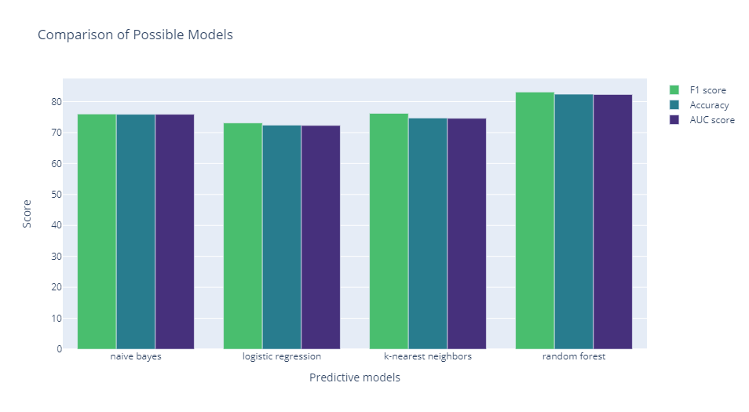
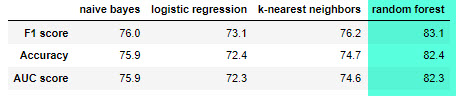
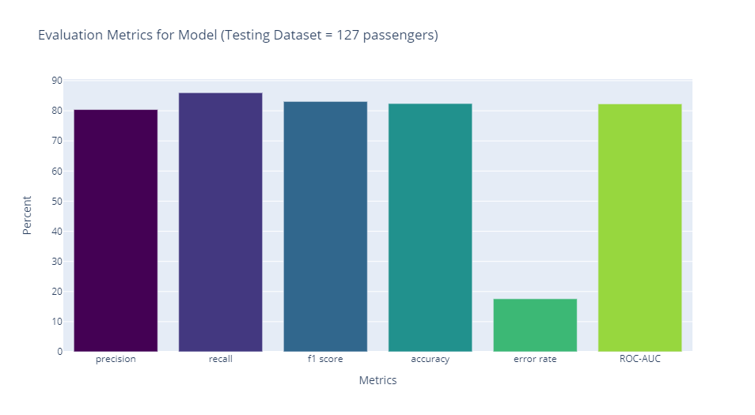

# Titanic Survival Classifier

Model analysis to improve prediction. 

## Approach
### Model balancing 

Source data set:
```
RangeIndex: 712 entries, 0 to 711
Data columns (total 8 columns):
 #   Column    Non-Null Count  Dtype  
---  ------    --------------  -----  
 0   Survived  712 non-null    int64  
 1   Pclass    712 non-null    int64  
 2   Sex       712 non-null    object 
 3   Age       712 non-null    float64
 4   Fare      712 non-null    float64
 5   Embarked  712 non-null    object 
 6   Name      712 non-null    object 
 7   SibSp     712 non-null    int64  
 ```
`Note: SibSp = Number of Siblings and Spouse`

Target variable: Survived (1 = True, 0 = False), with the following counts:
```
0 =  424
1 =  288
```

In order to provide a more balanced data set, oversampled survived by duplicating 136 randomly selected records from the Survived data set. 

### Feature selection
1. Converted Age to age bins. Increase age bins from 4 to 7 bins, to test impact of model accuracy. 
2. Parsed out title from full name as its own variable. Converted to common titles Miss, Mrs. and Mr., and bundled the remaining titles as VIP. About 3% of sample records were classified as VIP.
3. Used `dummies` pandas function to convert the following features:<br> `Sex, Pclass, Embarked, SibSp, age_binned `
4. Reviewed correlation matrix of features to survival rate, and retained for the final model features with a correlation coefficient with an absolute value greater than 0.1.  

Final list of features: <br>
`'Fare', 'Name', 'female', 'male', 'Cabin Class 1', 'Cabin Class 3', 'Cherbourg', 'Southampton', 'SibSp_0', 'SibSp_1', 'Age (18, 25]', 'Mr.', 'Mrs.', 'Miss'`

### Model Evaluation 
Using a 20% test sample, the following models were evaluated, with Random Forest providing the highest prediction accuracy:
<br>


#### Final model metrics

```
precision:	80.4% - how often is yes prediction correct - TP/(TP + FP)
recall:	        86.0% - how often predict yes when the answer is actually yes 
                        TP/(TP + FN) 
f1 score:	83.1% - precision and recall combined
accuracy:	82.4% - how often is the model correct - (TP + TN)/TOTAL
error rate:	17.6% - reverse of accuracy, how often the model is incorrect 
                        (FP + FN)/TOTAL
ROC-AUC:	82.3% - Area Under the Curve, ability of the model to distinguish
                        between positive and negative
```

### Github code
* [Model Evaluation Jupyter Notebook](https://github.com/Dangee/titanic-survival-classifier-model/blob/main/titanic-eda.ipynb)
* [Data source](https://www.kaggle.com/c/titanic)